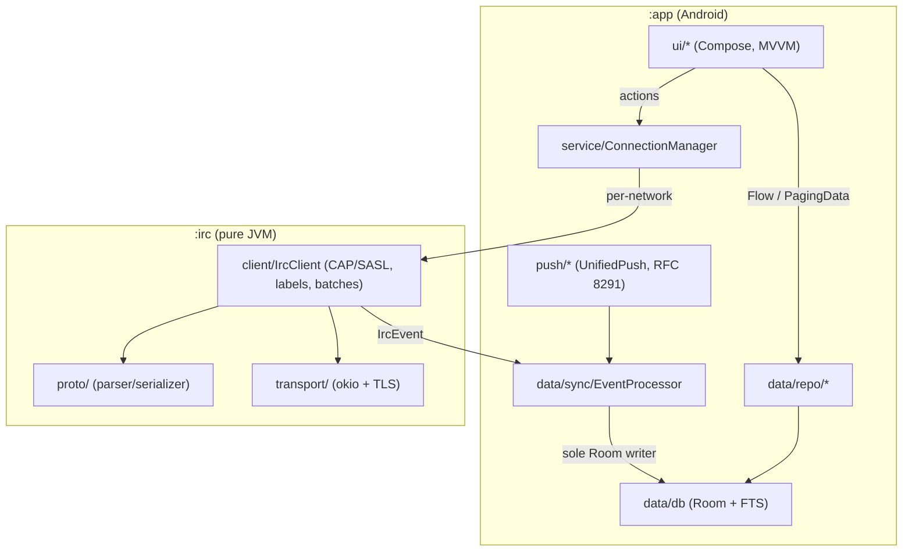

# Architecture

Two Gradle modules: `:app` (Android) and `:irc` (pure JVM, zero Android
dependencies).

Key invariants:

- `EventProcessor` is the only component that writes IRC-derived state to Room.
- The UI reads only from repositories and sends actions only through
  `ConnectionManager`.
- TLS policy and client certificates are injected into `:irc` via
  `TransportFactory`, keeping the protocol module free of Android APIs.

Design documents live in [`plans/`](plans/).
