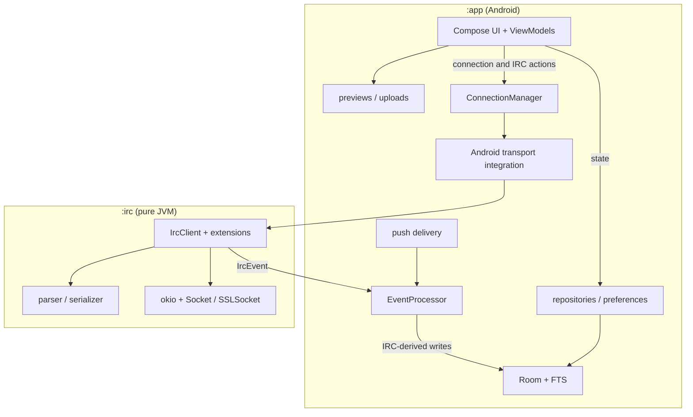

# Architecture

MOTD has two Gradle modules: `:app` is the Android application and `:irc` is a
pure-JVM IRC engine with no Android dependencies.

## Key invariants

- `EventProcessor` is the only component that writes IRC-derived state to Room.
  Feature-local persistence, such as preferences and upload history, remains
  behind its own repository or preference contract.
- UI observes repositories and ViewModel state. Connection and protocol actions
  go through `ConnectionManager` instead of constructing IRC clients in screens.
- TLS policy, Android KeyChain integration, proxy selection, and embedded
  obfuscation are injected at the `:app` boundary so `:irc` stays pure JVM.
- IRC TCP/TLS uses okio over `Socket`/`SSLSocket`. App-side WebSocket transport
  uses the pinned OkHttp dependency. HTTP previews and attachment uploads use
  their existing `HttpURLConnection`-based streaming implementations.
- FOSS and Google are supported product flavors. The Google flavor adds optional
  Firebase Cloud Messaging; the FOSS flavor remains Google-free. The E2E build
  is x86_64-compatible and intentionally omits the arm64-only libbox JNI.

## Where to work

- `app/src/main/.../ui/` — Compose screens, components, navigation, and
  ViewModels.
- `app/src/main/.../data/` — Room, repositories, sync, preferences, and feature
  persistence.
- `app/src/main/.../service/` — connection ownership and Android lifecycle.
- `irc/src/main/` — protocol, client state machine, extensions, and transport.

Repository policy and task workflows live in [`AGENTS.md`](AGENTS.md) and
[`.agents/`](.agents/README.md). Historical design documents under
[`plans/`](plans/README.md) explain original intent but are not current
contracts.
