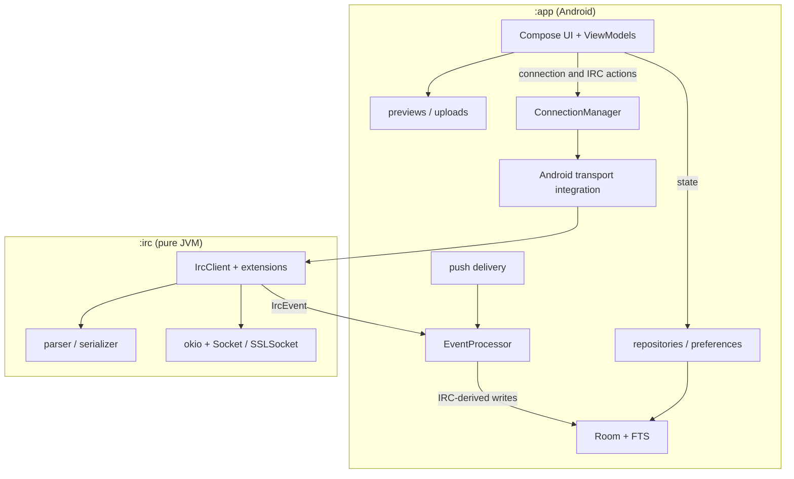

# Architecture

motd has four Gradle modules: `:app` is the Android application, `:irc` is a
pure-JVM IRC engine with no Android dependencies, `:ai-whisper` isolates
the source-built Android voice-transcription runtime, and `:ai-text` contains
the source-built CPU text engine. Native modules have no download API
and do not bundle model weights; the text engine also has a host smoke runner.

```mermaid
flowchart TD
    subgraph app[":app (Android)"]
        ui["Compose UI + ViewModels"]
        repo["repositories / preferences"]
        db["Room + FTS"]
        proc["EventProcessor"]
        push["push delivery"]
        upload["previews / uploads"]
        cm["ConnectionManager"]
        androidTransport["Android transport integration"]
    end
    subgraph irc[":irc (pure JVM)"]
        client["IrcClient + extensions"]
        proto["parser / serializer"]
        socket["okio + Socket / SSLSocket"]
    end

    ui -->|state| repo
    ui -->|connection and IRC actions| cm
    repo --> db
    client -->|IrcEvent| proc
    proc -->|IRC-derived writes| db
    push --> proc
    cm --> androidTransport
    androidTransport --> client
    client --> proto
    client --> socket
    ui --> upload
```

## Key invariants

- `EventProcessor` is the only component that writes IRC-derived state to Room.
  Feature-local persistence, such as preferences and upload history, remains
  behind its own repository or preference contract.
- A late IRC `001` after bouncer fallback Ready updates `IrcClient`'s self nick
  before mapping following JOINs. Exact identity changes publish `Registered`
  with current CAP/ISUPPORT snapshots for persistence; the welcome remains `Raw`,
  and late `005` retains the corrected nick.
- UI observes repositories and ViewModel state. Connection and protocol actions
  go through `ConnectionManager` instead of constructing IRC clients in screens.
- The chat-list Scaffold canvas and chat rows use theme `surface`, matching the top bar's original unscrolled `surface`; its scrolled `surfaceContainerLow` remains unchanged. After any network-activity banner and active-scope chip, folder tabs overlay the scrolling chat viewport on an unpainted, transparent strip; the measured tab-and-pinned-mentions header is reserved only for the list's initial position, so rows can scroll beneath it. A separate `surfaceContainerHigh` capsule carries the tabs, and the selected pill uses the stronger `primary`/`onPrimary` colors.
- The chat list has one compact, inspectable network-activity banner. The highest-severity,
  oldest unacknowledged connection/history issue wins; connection, waiting and sync summaries
  support it without rotation. Engine progress remains visible independently of failures.
  Banner text occupies at most two single-line rows: an ellipsized headline with issue badge, then
  an ellipsized supporting summary with a separately reserved inline fraction. Summary overflow never
  displaces the count; a thin progress bar adds no text row. Full reasons remain in the inspector.
  Only the static headline announces politely. Healthy idle hides; archive/invitations promote
  connection activity only, while the Material inspector remains global and preserves list modes.
  A separately labeled hide button latches the process-local `NetworkActivityBannerSession` hidden.
  New issues, navigation entries, progress, rotation and warm Activity relaunch never restore it;
  a genuinely new process starts unhidden and uses the normal startup/sync eligibility gates.
  Neither overflow menu offers restoration; the inspector is always available.
  Hiding acknowledges nothing or changes source state.
  While hidden, both overflow buttons show a static theme-accent dot for unseen active issues;
  both inspector menu entries pair a decorative network icon with `Network activity · New`.
  Hide and every inspector entry baseline a navigation-entry VM-owned attention watermark,
  without acknowledging or resolving issues. All-active-clear removes the cue even with recent records.
  Connection-only notices retain their three-second grace; presented history waiting bypasses it.
  The existing history anti-flash/minimum-visible presenter also gates per-row queued cues.
- `ChatListViewModel` eagerly captures observed connection/history failures even without screen
  subscribers. Its issue queue and seen watermark belong to the retained chat-list navigation entry,
  not the process-wide banner hide latch. A new entry gets a fresh queue/watermark but shares the latch.
  A small in-memory ledger retains one episode per network connection or history source status-map key.
  A different exact cause replaces the prior episode, honestly marked Replaced in newest-first recent
  activity (capped at 20); acknowledged episodes are discarded on replacement or finish.
  Same-cause retries count reentry, not duplicate snapshots, without undoing acknowledgement.
  Failed/Partial are history severities: switching them updates the same episode.
  A monotonic attention sequence advances only for new causes/episodes or actual severity increases,
  not retries, revisions, names, progress, acknowledgement or recovery; clearing recent cannot erase it.
  The eager unseen derivation requires unacknowledged current issues and resets on a new VM session.
  Acknowledgement is explicit and exact episode/revision guarded, including retry and unknown states:
  it hides promotion, the history error badge and full issue rows, never source status or retries.
  A compact acknowledged-still-active count avoids claiming recovery. Only severity increases or a
  different/new episode re-arm acknowledgement; ordinary same-cause retry remains quiet.
  Current unacknowledged issues precede compact named network/status rows with native action menus.
  Details explicitly expands selectable full reasons and first/last/occurrence metadata from two-line
  previews. Recent is collapsed by default; its Clear action only empties recent and invalidates delayed
  recent navigation, preserving active suppression, source state, attention and the seen watermark.
  Closing the inspector acknowledges nothing; recovery/navigation actions hide it before dispatch.
  Recent records retain their honest disposition and usable navigation; later target deletion disables
  their actions without rewriting the earlier recovery outcome. The inspector is available in every mode.
  Ready proves Connected; deliberate offline and deletion mean Stopped/Removed. History disappearance
  means No longer reported, not repaired; Unavailable and unknown connection absence are not recovery.
  History Retry requires the exact current episode and source kind/reason, canonical buffers and the
  current-client guarded reconciliation API. Connect rejects Ready/Connecting/Registering sockets.
  Certificate consent stays separate.
  History issue identity follows the source status-map key even when repository observation returns
  a redirected canonical room; navigation/reconciliation validate that room's network before using
  the issue network's live client. Reconcile accepts a separate `statusOwnerId`: Room writes, cursors
  and coalescing remain canonical, while Queued/Syncing/terminal status and its generation belong to
  the original observed source. Canonical and redirected status owners attach to the same flight,
  replay its current phase or terminal, and settle through the existing guarded session without
  duplicate wire work or resurrecting dismissed generations. Ordinary consumers (including chat's
  operational room, not its stale route) use the canonical room ID as their status owner.
  Reconcile-only publication never takes the network retirement guard; network sessions retain
  retirement-before-session locking. Syncing broadcasts snapshot their owners so synchronous
  observers can attach another owner without invalidating the current iteration.
- Appearance's input style is an IRC-only preference shared by channel, query,
  and server buffers. Default, Large, and Nickname use one editor/draft path;
  Nickname's network-owned identity is decoration, never submitted text.
  The input host overlays the full timeline; matching scroll padding keeps the
  newest row clear, and fully covered rows do not advance read state. Default and
  Nickname keep tools/send/record inside their floating pills; Large keeps its
  separate action. Agentwire always uses Default. Stored enum names are unchanged.
  Opening tools expands the same floating pill around one horizontally scrolling
  row. Markdown and draft upload are direct actions, not an overflow menu.
  Large keeps its separate top toolbar.
  Toolbar long-press shows the action name and purpose, with a Markdown example;
  normal taps perform actions. Voice recording retains its separate hold gesture.
- Chat's positive `placeAtTop` entry snaps compact chrome and waits for its measured
  viewport before unread-row alignment. A shallow run that clamps at the effective
  bottom restores expanded chrome and waits for that layout before consuming the target.
  Target consumption preserves the final header, viewport and unread placement; settled
  reader scrolls still animate, and latest stays expanded.
- TLS policy, Android KeyChain integration, proxy selection, and embedded
  obfuscation are injected at the `:app` boundary so `:irc` stays pure JVM.
- Each saved network owns its own ordered post-connect commands. `ConnectionActor`
  runs them once per physical Ready connection after registration; plaintext
  configuration backups omit them because commands can contain credentials.
- IRC TCP/TLS uses okio over `Socket`/`SSLSocket`. App-side WebSocket transport
  uses the pinned OkHttp dependency. Link metadata and attachment uploads retain
  their `HttpURLConnection`-based streaming implementations.
- Network-owned images, avatars, icons, video, and image Save use `NetworkMediaHttp`
  with `routeForNetwork`, native OkHttp/Coil caching scoped by network, and Media3's
  OkHttp adapter for streaming/range requests. The route lease lasts through
  response consumption and is released on completion, close, or cancellation.
  Missing/orphaned networks and broken routes fail closed; GET/HEAD requests
  and redirects carry no credentials. HTTPS retains platform validation or
  the route's destination-scoped certificate pin, never blanket trust.
  Link metadata and extensionless-audio HEAD discovery use that same owning route;
  there is no direct-preview bypass. Global avatars require an unambiguous source
  network, while imported avatar files remain local.
- The app ships as a single Google-free build with no product flavors; push
  delivery is UnifiedPush only. The E2E build is x86_64-compatible and
  intentionally omits the arm64-only libbox JNI.
- TTS Reader is explicitly enabled from a channel/query overflow menu for the
  current resumed chat. `EventProcessor` admits only newly inserted live
  peer messages; history, echoes, ignored speakers, muted rooms and fools do not
  authorize automatic speech. While the reader is enabled, tapping a visible
  message reads it immediately, even paused, including earlier and own messages;
  only that selected row joins the session, with the same room/audio/fools guards.
  Standalone voice-message backgrounds read the sanitized “voice message” label;
  audio playback, seek and details controls keep their own actions.
  `ReadAloudController` owns a bounded, disposable session: previous replays session
  entries, latest selects its newest entry, and leaving or backgrounding clears it.
  Selection stops audio immediately, drains the previous worker, and refreshes
  retained canonical identities and settled timeline anchors before insertion;
  it neither duplicates coalesced events nor loads neighboring history.
  Recording, competing playback and focus loss stop speech. Installed Android TTS
  generates temporary audio for true pause/resume; playback completion precedes
  the configurable inter-message gap. Only installed voices reported as offline
  are offered; third-party speech engines still receive text and are not a privacy
  sandbox. Settings → Chat → Voice / Audio → TTS Reader and the chat's Voice options
  open the same device-local voice, speed, pitch and gap profile. Voice preview
  never enables chat narration. Preference changes stop audio and cancel/drain
  the old worker before replacing speech at the same cursor and pause state.
- Local AI is opt-in. `AiExecutionCoordinator` serializes Whisper transcription
  and text generation with one resident model, cancels and joins actual native
  workers before unload or deletion, and unloads on backgrounding.
  Imported weights and settings are backup-excluded; transcripts are disposable
  caches and never enter IRC history. Legacy transcription and installed Android
  voice settings survive migration; retired model files/directories remain unused
  in private storage rather than being automatically deleted.
- When Agentwire Labs is enabled, Agentwire Summary prepares catch-up or thread
  context for an existing session. Frozen visible messages and coverage disclosures stay in memory until the user
  chooses an Agentwire channel, reviews its authenticated session, and presses
  Send. Context never enters ordinary IRC drafts. Sending shares it with that
  channel and its history, and the configured agent/model provider. Replies use
  the normal harness, converting supported Markdown to IRC formatting for display
  while retaining the original text. Agentwire uses its own backend credentials,
  not a motd subscription gateway. Search remains keyword-based; there is no semantic index.
- Book search Labs is a local default-off preference. The chat helper appears only in IRC Highway
  `#ebooks`; it starts a plain `@Search` draft. The DCC offers entry shows incoming, non-removed
  offers from the same network. Review sender, endpoint risk, and transfer status there.
  Receive results privately accepts an offered ZIP into app-private cache (16 MiB compressed cap,
  including unknown-size transfers); Save still selects a SAF destination for other files.
  Completed incoming records in chat, DCC offers and Direct Connections have a file overflow →
  Save to Downloads action. It copies the retained original bytes (including unsupported results
  ZIPs) to public Downloads without a picker or changing the source. API 29+ publishes a pending
  MediaStore download only after the copy closes; API 26–28 requests legacy storage write access
  and publishes a completed temporary file without replacing an existing download.
  Private/local endpoints require explicit Allow once consent. Completed ZIPs have View results;
  Open results ZIP remains available for manual selection. Removing a record discards only owned
  cached files; generic SAF destinations and exported Downloads copies are never deleted.
  Bounded text-entry parsing displays
  validated requests. Request sends the selected exact channel message immediately through the
  ordinary composer draft/submit path, only in the eligible joined, ready room with an unoccupied
  draft and no reply. Rejected sends restore the draft. Offers are not correlated to searches and
  transfers are never accepted automatically; users explicitly receive or save them.
- `NotificationSettings` resolves device-local global, exact-network, and canonical-channel
  policies. The first LIVE/PUSH observation freezes each event's eligibility and watch mute
  bypass; HISTORY/REPLAY supply notification context without resolving that decision.
  Watches admit live channel PRIVMSG/ACTION and pushed highlights despite policy or mute;
  ordinary `ALL` policy never bypasses mute or broadens push delivery. Self, ignore, fool,
  foreground, and read suppression remain. Interrupted notification recovery reads the stored
  decision, never later settings, and always presents silently.
  Android Auto support is notification-only in the same Google-free APK: DMs and channel
  mentions expose no-UI semantic reply/mark-read actions. Ordinary `ALL`/watch channel
  messages use disjoint local-only rows; body histories and canonical read/open anchors
  stay lane-specific. Local-only is a bridging hint, not a security boundary. Channel
  replies use the actual public `ircTarget`, never an internal alias or the mention sender.
  Notification replies request one reconnect when not Ready and allow five seconds for
  the current client to become Ready and, for channels, self-JOIN; expiry never queues
  a later send. Submission uses the existing durable sender once. Pre-persistence rejection
  preserves text with phone-only manual Retry; uncertain durable/wire delivery preserves
  drafts and durable rows with a phone-only review notice, without text-based Retry.

## Where to work

- `app/src/main/.../ui/` — Compose screens, components, navigation, and
  ViewModels.
- `app/src/main/.../data/` — Room, repositories, sync, preferences, and feature
  persistence.
- `app/src/main/.../service/` — connection ownership and Android lifecycle.
- `irc/src/main/` — protocol, client state machine, extensions, and transport.

Repository policy and task workflows live in [`AGENTS.md`](AGENTS.md) and
[`.agents/`](.agents/README.md).
