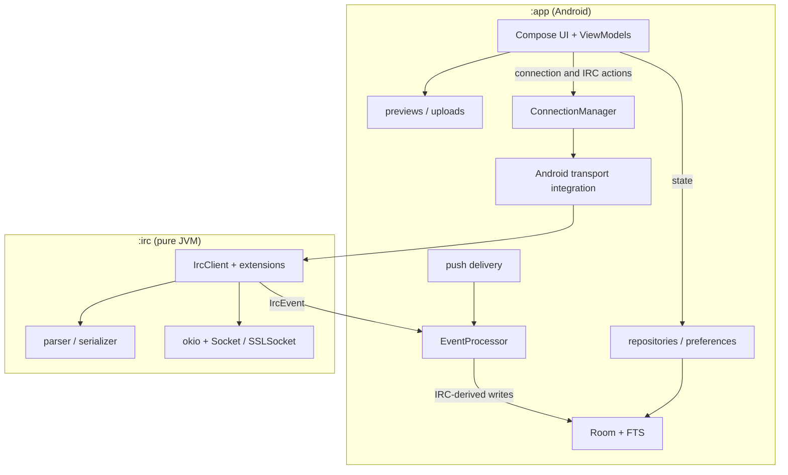

# Architecture

motd has five Gradle modules: `:app` is the Android application, `:irc` is a
pure-JVM IRC engine with no Android dependencies, `:ai-whisper` isolates
the source-built Android voice-transcription runtime, `:ai-text` contains
the source-built CPU text engine, and `:ai-tts` contains the source-built
Sherpa/ONNX Runtime Kokoro speech engine. Native modules have no download API
and do not bundle model weights; text and speech also have host smoke runners.

```mermaid
flowchart TD
    subgraph app[":app (Android)"]
        ui["Compose UI + ViewModels"]
        repo["repositories / preferences"]
        db["Room + FTS"]
        proc["EventProcessor"]
        push["push delivery"]
        upload["previews / uploads"]
        cm["ConnectionManager"]
        androidTransport["Android transport integration"]
    end
    subgraph irc[":irc (pure JVM)"]
        client["IrcClient + extensions"]
        proto["parser / serializer"]
        socket["okio + Socket / SSLSocket"]
    end

    ui -->|state| repo
    ui -->|connection and IRC actions| cm
    repo --> db
    client -->|IrcEvent| proc
    proc -->|IRC-derived writes| db
    push --> proc
    cm --> androidTransport
    androidTransport --> client
    client --> proto
    client --> socket
    ui --> upload
```

## Key invariants

- `EventProcessor` is the only component that writes IRC-derived state to Room.
  Feature-local persistence, such as preferences and upload history, remains
  behind its own repository or preference contract.
- UI observes repositories and ViewModel state. Connection and protocol actions
  go through `ConnectionManager` instead of constructing IRC clients in screens.
- TLS policy, Android KeyChain integration, proxy selection, and embedded
  obfuscation are injected at the `:app` boundary so `:irc` stays pure JVM.
- Each saved network owns its own ordered post-connect commands. `ConnectionActor`
  runs them once per physical Ready connection after registration; plaintext
  configuration backups omit them because commands can contain credentials.
- IRC TCP/TLS uses okio over `Socket`/`SSLSocket`. App-side WebSocket transport
  uses the pinned OkHttp dependency. Link metadata and attachment uploads retain
  their `HttpURLConnection`-based streaming implementations.
- Network-owned images, avatars, icons, video, and image Save use `NetworkMediaHttp`
  with `routeForNetwork`, native OkHttp/Coil caching scoped by network, and Media3's
  OkHttp adapter for streaming/range requests. The route lease lasts through
  response consumption and is released on completion, close, or cancellation.
  Missing/orphaned networks and broken routes fail closed; GET/HEAD requests
  and redirects carry no credentials. HTTPS retains platform validation or
  the route's destination-scoped certificate pin, never blanket trust.
  Link metadata and extensionless-audio HEAD discovery use that same owning route;
  there is no direct-preview bypass. Global avatars require an unambiguous source
  network, while imported avatar files remain local.
- The app ships as a single Google-free build with no product flavors; push
  delivery is UnifiedPush only. The E2E build is x86_64-compatible and
  intentionally omits the arm64-only libbox JNI.
- Incoming chat speech is explicitly enabled from a channel/query overflow menu
  for the current resumed chat. `EventProcessor` admits only newly inserted live
  peer messages; history, echoes, ignored speakers, muted rooms and fools do not
  authorize speech. `ReadAloudController` owns a bounded, disposable session:
  previous replays session entries, latest selects its newest entry, and leaving
  or backgrounding clears it. Recording, competing playback and focus loss stop
  speech. Both providers generate temporary audio for true pause/resume; playback
  completion precedes the configurable inter-message gap. Only installed Android
  voices reported as offline are offered; third-party speech engines still receive
  text and are not a privacy sandbox. AI Labs can explicitly download, validate,
  assign and enable the pinned Kokoro English bundle atomically. Its male/female
  voices and profile are independent of installed speech. An enabled local override
  fails visibly if unavailable or corrupt, never silently falling back. Labs voice
  previews do not enable chat narration.
- Local AI is opt-in. `AiExecutionCoordinator` serializes Whisper transcription,
  text generation and Kokoro synthesis with one resident model, cancels and joins
  actual native workers before unload or deletion, and unloads on backgrounding.
  Imported weights and settings are backup-excluded; transcripts are disposable
  caches and never enter IRC history. Legacy voice settings survive migration;
  retired text-model imports remain unused in private storage rather than being
  automatically deleted.
- When Agentwire Labs is enabled, Agentwire Summary prepares catch-up or thread
  context for an existing session. Frozen visible messages and coverage disclosures stay in memory until the user
  chooses an Agentwire channel, reviews its authenticated session, and presses
  Send. Context never enters ordinary IRC drafts. Sending shares it with that
  channel and its history, and the configured agent/model provider. Replies use
  the normal harness, converting supported Markdown to IRC formatting for display
  while retaining the original text. Agentwire uses its own backend credentials,
  not a motd subscription gateway. Search remains keyword-based; there is no semantic index.
- Book search Labs is a local default-off preference. The chat helper appears only in IRC Highway
  `#ebooks`; it starts a plain `@Search` draft. The DCC offers entry shows incoming, non-removed
  offers from the same network. Review sender, endpoint risk, and transfer status there.
  Receive results privately accepts an offered ZIP into app-private cache (16 MiB compressed cap,
  including unknown-size transfers); Save still selects a SAF destination for other files.
  Private/local endpoints require explicit Allow once consent. Completed ZIPs have View results;
  Open results ZIP remains available for manual selection. Removing a record discards only owned
  cached files; generic SAF destinations are never deleted. Bounded text-entry parsing displays
  validated requests. Request sends the selected exact channel message immediately through the
  ordinary composer draft/submit path, only in the eligible joined, ready room with an unoccupied
  draft and no reply. Rejected sends restore the draft. Offers are not correlated to searches and
  transfers are never accepted automatically; users explicitly receive or save them.
- `NotificationSettings` resolves device-local global, exact-network, and canonical-channel
  policies. The first LIVE/PUSH observation freezes each event's eligibility and watch mute
  bypass; HISTORY/REPLAY supply notification context without resolving that decision.
  Watches admit live channel PRIVMSG/ACTION and pushed highlights despite policy or mute;
  ordinary `ALL` policy never bypasses mute or broadens push delivery. Self, ignore, fool,
  foreground, and read suppression remain. Interrupted notification recovery reads the stored
  decision, never later settings, and always presents silently.
  Android Auto support is notification-only in the same Google-free APK: DMs and channel
  mentions expose no-UI semantic reply/mark-read actions. Ordinary `ALL`/watch channel
  messages use disjoint local-only rows; body histories and canonical read/open anchors
  stay lane-specific. Local-only is a bridging hint, not a security boundary. Channel
  replies use the actual public `ircTarget`, never an internal alias or the mention sender.
  Notification replies request one reconnect when not Ready and allow five seconds for
  the current client to become Ready and, for channels, self-JOIN; expiry never queues
  a later send. Submission uses the existing durable sender once. Pre-persistence rejection
  preserves text with phone-only manual Retry; uncertain durable/wire delivery preserves
  drafts and durable rows with a phone-only review notice, without text-based Retry.

## Where to work

- `app/src/main/.../ui/` — Compose screens, components, navigation, and
  ViewModels.
- `app/src/main/.../data/` — Room, repositories, sync, preferences, and feature
  persistence.
- `app/src/main/.../service/` — connection ownership and Android lifecycle.
- `irc/src/main/` — protocol, client state machine, extensions, and transport.

Repository policy and task workflows live in [`AGENTS.md`](AGENTS.md) and
[`.agents/`](.agents/README.md).
