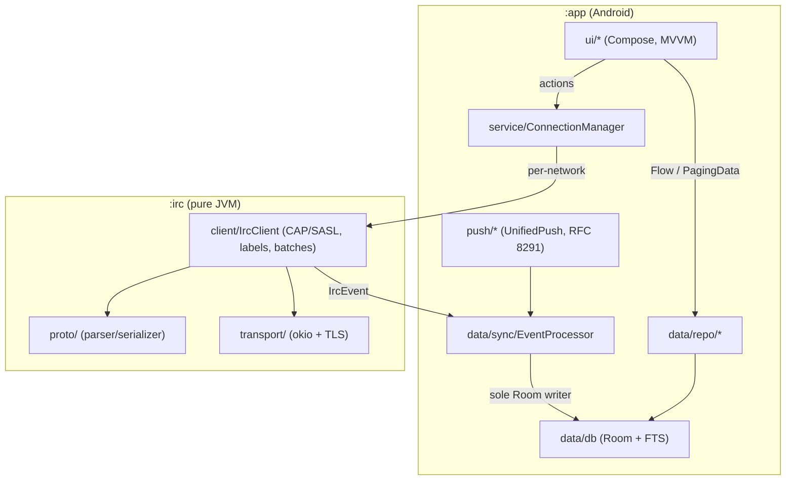

<p align="center">
  
</p>

# MOTD

A native Android IRCv3 client with a Telegram-style UI. Written in Kotlin with
Jetpack Compose and Material 3.

Connects directly to IRC networks or through a [soju](https://soju.im) bouncer.
Bouncer capabilities are detected via CAP and enabled when present: infinite
scrollback (`draft/chathistory`), cross-device read state (`draft/read-marker`),
multi-network over one account (`soju.im/bouncer-networks`), and push
(`soju.im/webpush` + UnifiedPush). Plain networks degrade to local-only history
and a persistent-socket connection.

## Features

| Feature | Description |
|---|---|
| Chat UI | Unified chat list with unread/mention badges; grouped message bubbles, day separators, event pills, inline images, and OG link previews. |
| Composer | Nick autocomplete, replies (`+draft/reply`), reactions (`+draft/react`), typing (`+typing`), and slash commands (`/msg`, `/query`, `/join`, `/me`). |
| Search | FTS4 full-text search over history, global or scoped to one buffer, with deep-jump to the matched message. |
| Scrollback | Paging 3 backed by a `draft/chathistory` RemoteMediator; local-only fallback on plain networks. |
| Read state | `draft/read-marker` (MARKREAD) sync through a single `ConnectionManager` entry point. |
| Multi-network | `soju.im/bouncer-networks` (BOUNCER BIND) with one root connection plus per-network child bindings. |
| Delivery modes | Persistent-socket foreground service, or UnifiedPush + `soju.im/webpush` with on-device RFC 8291 (aes128gcm) decryption. |
| Theming | Material You dynamic color on Android 12+, plus SYSTEM/LIGHT/DARK/AMOLED themes. |
| Transport | okio over `SSLSocket`, SASL PLAIN/EXTERNAL, client certificates via Android KeyChain, IRCv3 STS pinning. |

## Architecture

Two modules: `:app` (Android) and `:irc` (pure JVM, zero Android dependencies).



- `EventProcessor` is the only component that writes IRC-derived state to Room.
- UI reads only repositories and sends actions only through `ConnectionManager`.
- TLS policy and client certs are injected into `:irc` via `TransportFactory`.

Design documents live in [`plans/`](plans/).

## Screenshots

_Placeholder — add device captures here._

| Chat list | Chat screen | Search | Settings |
|-----------|-------------|--------|----------|
| _TODO_    | _TODO_      | _TODO_ | _TODO_   |

## Building

CI is the canonical build environment (see
[`.github/workflows/`](.github/workflows/)). Locally, the Nix flake provides
JDK 17 and the Android SDK; direnv loads it via `.envrc`.

```sh
nix develop -c ./gradlew :irc:test               # :irc protocol tests (pure JVM)
nix develop -c ./gradlew :app:testDebugUnitTest  # :app unit tests (Robolectric)
nix develop -c ./gradlew :app:assembleDebug      # debug APK
nix develop -c ./gradlew build                   # tests + lint + APKs
```

APKs land in `app/build/outputs/apk/`.

## Manual smoke checklist

Run against Libera.Chat after installing the debug APK:

1. Install (`adb install app/build/outputs/apk/debug/app-debug.apk`) and launch;
   grant the POST_NOTIFICATIONS prompt.
2. Onboard: the empty chat list routes to onboarding. Add a network — host
   `irc.libera.chat`, port `6697`, TLS on, a nick, SASL PLAIN with NickServ
   credentials (or SASL NONE).
3. Connect: the banner reaches "Ready" and a status notification appears.
4. Join `#libera`. The buffer opens with its member list populated.
5. Send and receive: post a message and confirm the echo dedups to one row;
   others' messages arrive live. Try `/me`, a reply, and a reaction.
6. Search: query a word you sent; the hit jumps to it.
7. Theme: toggle LIGHT/DARK/AMOLED and dynamic color; the UI recolors.
8. DM: `/msg <nick> hi` opens a new QUERY buffer.

## Releasing

Releases are cut by pushing a `v*` tag; `release.yml` builds and uploads a
signed APK. `versionName` comes from the tag; `versionCode` from the CI run
number.

```sh
git tag -s v0.1.0 -m "v0.1.0"
git push origin v0.1.0
```

CI decodes the keystore from `KEYSTORE_BASE64`, runs `:app:assembleRelease` with
the signing env (`MOTD_KEYSTORE_PATH`, `MOTD_KEYSTORE_PASSWORD`,
`MOTD_KEY_ALIAS`, `MOTD_KEY_PASSWORD`), renames the artifact to
`motd-<tag>.apk`, and attaches it to a GitHub release. Required repository
secrets: `KEYSTORE_BASE64`, `KEYSTORE_PASSWORD`, `KEY_ALIAS`, `KEY_PASSWORD`
(see [`plans/08-ci-release.md`](plans/08-ci-release.md)).

To dry-run locally: `nix develop -c ./gradlew :app:assembleRelease` with the
signing env set (or the debug signing config).
