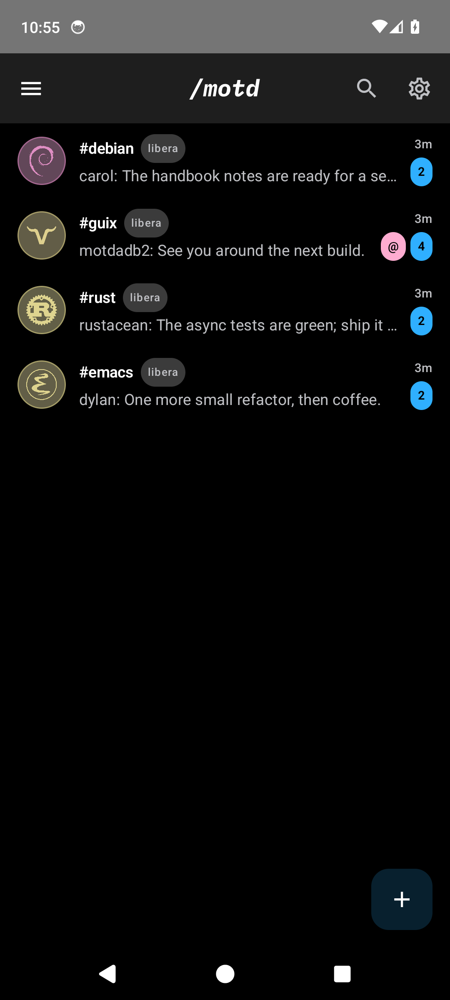
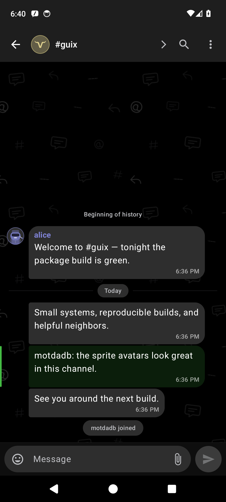
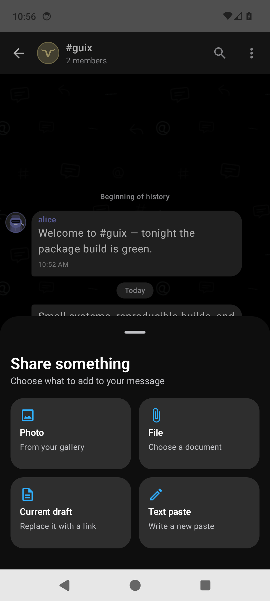

<p align="center">
  <picture>
    <source media="(prefers-color-scheme: dark)" srcset="docs/assets/brand/motd-lockup-dark.svg">
    
  </picture>
</p>

<p align="center"><strong>A native Android IRC client with a Telegram-style chat UI.</strong></p>

<p align="center">
  <a href="https://github.com/trevarj/motd/releases/latest"></a>
  <a href="https://f-droid.org/packages/io.github.trevarj.motd"></a>
  <a href="https://github.com/trevarj/motd/releases"></a>
  <a href="https://github.com/trevarj/motd/actions/workflows/ci.yml"></a>
  <a href="LICENSE"></a>
  <a href="https://web.libera.chat/#motd"></a>
</p>

motd is built in Kotlin with Jetpack Compose and Material 3. It speaks IRCv3
and works best paired with a [soju](https://soju.im) bouncer — capabilities are
detected over CAP and enabled automatically — but it connects fine to plain
networks too, falling back to local-only history and a persistent socket.

- [Screenshots](#screenshots)
- [Features](#features)
- [Install](#install)
- [Connecting](#connecting)
- [Development](#development)
- [Community](#community)
- [License](#license)

## Screenshots

Each frame is split diagonally between the Ayu Light and Ayu Dark themes. See
them in motion on the [landing page](https://trevs.site/motd/).

<table>
  <tr>
    <td align="center"><strong>Chat list</strong></td>
    <td align="center"><strong>Conversation</strong></td>
    <td align="center"><strong>File uploader</strong></td>
  </tr>
  <tr>
    <td><a href="screenshots/chat-list.png"></a></td>
    <td><a href="screenshots/chat.png"></a></td>
    <td><a href="screenshots/file-uploader.png"></a></td>
  </tr>
</table>

## Features

- **Telegram-style chat** — unified chat list, grouped bubbles, day separators, event pills, inline images, and link previews
- **Infinite scrollback** — `draft/chathistory` paging through a bouncer, local-only history on plain networks
- **Cross-device read state** — `draft/read-marker` sync
- **Multi-network** — several networks over one bouncer connection (`soju.im/bouncer-networks`)
- **Push or persistent socket** — UnifiedPush + `soju.im/webpush` with on-device decryption, or a foreground service
- **Modern composer** — nick autocomplete, replies, reactions, typing indicators, and slash commands
- **Full-text search** — across all history or one buffer, with jump-to-message
- **Theming** — Material You dynamic color plus curated editor/terminal palettes (Ayu, Gruvbox, Catppuccin, Modus, and more)
- **Hardened transport** — TLS with SASL PLAIN/EXTERNAL, client certificates, IRCv3 STS pinning, and optional SOCKS5/Tor/VLESS obfuscation

## Install

[](https://f-droid.org/packages/io.github.trevarj.motd)

- **F-Droid**: [io.github.trevarj.motd](https://f-droid.org/packages/io.github.trevarj.motd)
- **GitHub**: APKs on the [releases page](https://github.com/trevarj/motd/releases/latest)

Both share the same signing key, so either install updates from the other.
Requires Android 8.0+ on a 64-bit ARM device (the embedded obfuscation
transport is arm64-v8a-only). Push delivery is UnifiedPush — see the
[ntfy setup guide](docs/ntfy-push.md).

## Connecting

**Direct**: add a network with host `irc.libera.chat`, port `6697`, TLS on,
and SASL PLAIN with your NickServ credentials (or SASL NONE).

**Through a bouncer**: point the network at your soju bouncer and authenticate
with your bouncer account; motd negotiates capabilities and manages your
upstream networks from a single connection. For CLoak, follow the
[CLoak guide](docs/cloak.md).

For SOCKS5, Tor, or embedded VLESS (TCP + REALITY or WebSocket + TLS), see the
[obfuscation guide](docs/obfuscation.md).

## Development

The Nix flake pins the toolchain (JDK 21 + Android SDK); run everything under
`nix develop`. Quick start:

```sh
git submodule update --init --recursive
nix develop -c ./gradlew :app:assembleDebug
```

- [Architecture](ARCHITECTURE.md)
- [Building and testing](docs/human-developing.md)
- [All runbooks](docs/README.md) — releasing, F-Droid updates, backups
- [E2E harness](test/e2e/README.md) — screenshots regenerate with `nix develop -c ./test/e2e/headless.sh showcase`
- [F-Droid packaging](docs/fdroid.md)

## Community

Questions, bug reports, and feedback: join
[`#motd` on Libera.Chat](https://web.libera.chat/#motd), or open an
[issue](https://github.com/trevarj/motd/issues).

## License

Copyright 2026 Trevor Arjeski. Licensed under the
[GNU GPL v3.0 or later](LICENSE). Third-party licensing is recorded in
[THIRD_PARTY_NOTICES.md](THIRD_PARTY_NOTICES.md).

This project has been developed with assistance from large language models;
contributions are reviewed, tested, and maintained by the project maintainer,
who remains responsible for the published code and releases.
